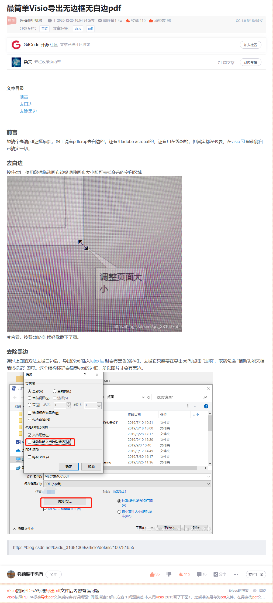

> **转载声明**
>
> - **原文作者：** 强殖装甲凯普
> - **原文链接：** [最简单Visio导出无边框无白边pdf](https://blog.csdn.net/qq_38163755/article/details/111690961)
> - **版权声明：** 本文转载自网络文章，转载目的仅为个人收藏与知识分享。若存在任何侵权问题，请随时与我联系，我会立即处理。如果您觉得这篇文章及相关项目对您有所帮助，不妨前往项目地址为原作者点个 star ，以表支持与鼓励 。

#### 1、按住Ctrl，找到边框，裁剪即可

#### 2、在菜单栏选择文件-导出-pdf，这时，点击选项 取消勾选辅助功能文档结构标记，即可去掉图片边框。

